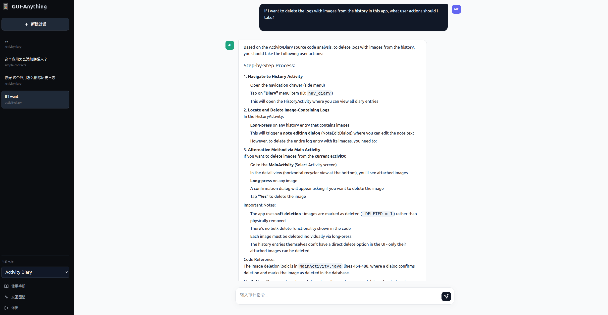

<p align="center">
  
</p>

# 📱 GUI-Anything

<p align="center">
  <b>English</b> | <a href="./README_zh.md">简体中文</a>
</p>

> An intelligent static analysis and security auditing platform for Android applications, powered by DeepSeek-V3 and Static Topology Mapping.

---

## 📖 Usage Guide

Here is a typical security audit interaction example, demonstrating how the platform answers specific operational questions based on static source code topology analysis:

> The user submits the following query: **"If I want to delete the logs with images from the history in this app, what user actions should I take?"**, and selects the target application **"Activity Diary"**.
>
> Based on the application's static analysis results (Activity transition chains, component dependencies, and database operation logic), the system generates the following reasoning response:
>
> <p align="center">
>   
> </p>
>
> The platform output includes:
> - **Clear step-by-step actions**: Navigate from the side menu to `HistoryActivity` and locate the target log entry;
> - **UI interaction details**: Long-press on an image to trigger the deletion confirmation dialog;
> - **Code-level evidence**: Points to the deletion logic at `MainActivity.java` lines 464–488, which implements a soft-delete mechanism (`_DELETED = 1`);
> - **Limitation disclosure**: Notes that the current implementation does not support batch deletion of entire log entries — only individual images can be deleted.
>
> This example showcases **GUI-Anything**'s ability to combine static topology mapping with LLM reasoning, delivering traceable and verifiable audit conclusions.

---

## ✨ Features
* **🧠 Intelligent Audit**: Deep analysis of Android logic flaws using LLM reasoning based on app topology.
* **📊 Interactive UI Map**: Visualize activity transitions and component relationships in real-time.
* **⚡ Streaming Response**: Smooth, real-time Markdown auditing reports with typing effects.
* **🛡️ High-Security Auth**: Sophisticated login/register system with a modern Glassmorphism UI.
* **🚀 Zero-Config Deployment**: Automatic API discovery logic—no need to hardcode IPs.

## 🛠️ Tech Stack
* **Frontend**: Vue 3, Vite, TypeScript, Lucide Icons, Marked.
* **Backend**: FastAPI, SQLite3, OpenAI SDK (DeepSeek), PyYAML.
* **Deployment**: Docker, Docker Compose.

## 🚀 Quick Start

### 1. Clone the repository
```bash
git clone [https://github.com/your-username/GUI-Anything.git](https://github.com/your-username/GUI-Anything.git)
cd GUI-Anything
```

### 2. Configure Backend Environment
Create a `.env` file in the `backend/` directory to store your credentials:
```bash
# backend/.env
OPENAI_API_KEY=sk-xxxxxx
OPENAI_BASE_URL=[https://api.deepseek.com](https://api.deepseek.com)
MODEL_NAME=deepseek-chat
```

### 3. One-Click Launch (Docker)
Ensure you have Docker and Docker Compose installed:
```bash
docker-compose up -d
```
The system will be accessible at `http://your-server-ip:3001`. The frontend will automatically detect and connect to the backend on port `8002`.

## 📂 Data Customization
Place your Android analysis results (JSON files) in `backend/data/`.
* `app_list.yml`: Manage project display names and IDs.
* `docs.md`: Edit this file to update the "User Manual" section in the app dynamically.

## 🤝 Contribution
Contributions, issues, and feature requests are welcome!

## 📜 License
This project is MIT licensed.

## 📚 Citation

If you find GUI-Anything useful for your research or project, please consider citing our paper:

```bibtex
@inproceedings{lin-etal-2025-uicompass,
    title = "{UICOMPASS}: {UI} Map Guided Mobile Task Automation via Adaptive Action Generation",
    author = "Lin, Yuanzhang and Zhang, Zhe and Rui, He and Dong, Qingao and Zhou, Mingyi and Zhang, Jing and Gao, Xiang and Sun, Hailong",
    booktitle = "Proceedings of the 2025 Conference on Empirical Methods in Natural Language Processing",
    month = nov,
    year = "2025",
    publisher = "Association for Computational Linguistics",
    doi = "10.18653/v1/2025.emnlp-main.1346"
}
```
